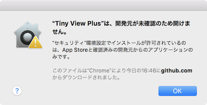
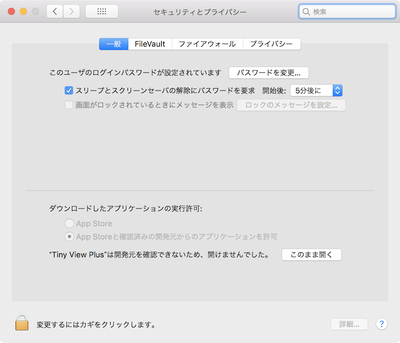

# Tiny View Plus

[English version](./README_en.md)

Tiny View Plusは、FPV映像を手軽に表示するためのアプリです。UVC対応の受信機を、MacBook等のコンピューターに接続して使用します。受信機は4台まで接続できます。openFrameworksを使って実装されており、高速に動作します。


## 動作環境

<table>
<tr>
<td>OS</td><td>macOS (Mojave推奨)<br/>Windows (10 64bit推奨)</td>
</tr>
<tr>
<td>受信機</td><td>Eachine ROTG02<br/>Eachine ROTG01</td>
</tr>
</table>

冒頭の写真の例では、USBハブ(C-A)とUSBケーブル(A-microB)を別途用意しています。この場合、ROTG付属のUSBケーブル(OTG用microB-microB)は使用しません。

ソースコードからビルドする場合には [openFrameworks](http://openframeworks.cc/ja/) v0.10.1 が必要です。openFrameworksが対応している他のOS(Ubuntu等)でも動作する可能性はありますが、未検証です。

## インストール

### ビルド済みバイナリを使用する場合(通常はこちら)

1. [リリースページ](https://github.com/t-asano/tinyviewplus/releases)よりzipファイルをダウンロード
2. zipファイルを適当な場所に展開

バイナリの作成にあたっては細心の注意を払っていますが、アプリを実行することで起こる不具合については、一切責任を負いません。

### ソースコードからビルドする場合(上級者向け)

1. [openFrameworks](http://openframeworks.cc/ja/) v0.10.1 をインストール
2. [ofxTrueTypeFontUCアドオン](https://github.com/hironishihara/ofxTrueTypeFontUC)を addons/ の下に配置
3. [ofxTrueTypeFontUCアドオンの修正パッチ](https://github.com/hironishihara/ofxTrueTypeFontUC/pull/29/commits/297e75e9cdccb6d29b507eccf16b84d8fef86a88)を適用
4. プロジェクトジェネレーターで、2つのアドオン(ofxOsc, ofxTrueTypeFontUC)を含むプロジェクトを作成
5. TinyViewPlusのソースコード(src/)とアセット(bin/data/)を上書き
6. ビルド

## 使い方

### 起動

1. コンピューターに受信機(4台まで)を接続
2. アプリ本体をダブルクリックして起動

macOSにおいて、ビルド済みバイナリを起動しようとすると、以下のような警告が表示されることがあります。



この場合、[システム環境設定] -> [セキュリティとプライバシー] -> [一般]を開き [このまま開く] をクリックすると、アプリを起動できます。



### 受信機の検出

受信機がうまく検出されない場合は、以下をお試し下さい。

1. アプリを終了
2. 受信機を全て外す
3. USBハブ使用の場合はそれを接続し直す、または撤去する
4. 受信機を一台ずつ数秒間隔で接続
5. アプリを起動

macOSの場合、QuickTimeアプリで、カメラ(受信機)のリストを表示できます。Tiny View Plusを実行する前に、カメラの検出状況を確認しておくと、問題の切り分けがしやすくなります。USBハブを使用していて、映像がコマ落ちするようなら、USBハブ1台あたりの受信機の数を3台以下を目安に減らしてください。

Windowsでは、デバイスマネージャーでカメラ(受信機)の検出状況を確認できます。なお、一つのUSBハブに複数の受信機を接続した場合に、そのうち1台しか動作しないことがあります。この場合、USBハブを経由せずに接続すれば、改善することがあります。

### キー操作

| キー | 機能 | 初期値 |
|---|---|---|
| H | ヘルプの表示 | - |
| 1~4 | カメラ1~4のソロ表示のオン/オフ | オフ |
| shift + 1~4 | カメラ1~4の表示のオン/オフ | オン |
| Q,W,E,R | カメラ1~4のアイコンの変更 | アプリ内蔵の画像 |
| L | カメラのラベルの変更 | Pilot1~4 |
| B | 背景画像の変更 | アプリ内蔵の画像 |
| S | 音声読み上げのオン/オフ(macOSのみ) | オフ |
| I | 設定の初期化(※1) | 各設定の初期値 |

- カメラのラベルを変更すると、アイコンが自動的に変更されます
	- macOSバイナリの場合は "Tiny View Plus.app/Contents/Resources/data/pilots" フォルダの下、それ以外の場合は "data/pilots" フォルダの下に、ラベル文字列.png または ラベル文字列.jpg という画像ファイルが見つかると、この優先順でアイコン画像として採用されます
	- 画像ファイルが見つからない場合は、デフォルトアイコンが採用されます
	- 縦横比は強制的に1:1となります
- 背景画像は、画面に合わせて拡大縮小され、左上が優先表示されます
- 音声読み上げは、外部アプリとの連携時に動作します
- (※1) 以下の設定項目が初期化されます
	- カメラの表示/非表示
	- カメラのアイコン
	- カメラのラベル
	- 音声読み上げのオン/オフ
	- 壁紙
- アプリを終了すると設定は消去されます
- カメラの音声は出力されません

### マウス操作

一部の機能は、マウスでも操作できます。

| クリック箇所 | 機能 |
|---|---|
| カメラ1~4のアイコン | カメラ1~4のアイコンの変更 |
| カメラ1~4のラベル | カメラ1~4のラベルの変更(※1) |

(※1)ラベルに合わせて、アイコンも自動的に変更されます。任意のアイコンを使用したい場合は、ラベル、アイコンの順で変更してください。

## OSCによる制御

OSCプロトコルにより外部からの制御が可能です。UDP4000番ポートでOSCパケットを受信します。

### メッセージフォーマット

#### カメラのソロ表示

/v1/camera/{id}/solo {switch}

- パラメーター
    - id ... 1～4の数値
    - switch ... "on" または "off"
- [例]カメラ1をソロ表示する
    - /v1/camera/1/solo "on"

#### カメラの表示/非表示

/v1/camera/{id}/display {switch}

- パラメーター
    - id ... 1～4の数値
    - switch ... "on" または "off"
- [例]カメラ1を非表示とする
    - /v1/camera/1/display "off"

#### カメラのラベルの変更

/v1/camera/{id}/label {label}

- パラメーター
    - id ... 1～4の数値
    - label ... 任意の文字列(パイロット名など)
- [例]カメラ2のラベルを"Whooper2"とする
    - /v1/camera/2/label "Whooper2"

ラベルの変更と連動して、アイコンも自動的に変更されます。

- macOSバイナリの場合は "Tiny View Plus.app/Contents/Resources/data/pilots" フォルダの下、それ以外の場合は "data/pilots" フォルダの下に、{label}.png または {label}.jpg という画像ファイルが見つかると、この優先順でアイコン画像として採用します
- 画像ファイルが見つからない場合は、デフォルトアイコンが採用されます
- 縦横比は強制的に1:1となります

#### カメラのラップタイムの更新

/v1/camera/{id}/laptime {time}

- パラメーター
    - id ... 1～4の数値
    - label ... ラップタイムを示す数値(秒)
- [例]カメラ3のラップタイムを128秒64とする
    - /v1/camera/3/laptime 128.64
- [例]カメラ4のラップタイムをクリアする
    - /v1/camera/4/laptime 0

#### 音声読み上げ(macOSのみ)

/v1/speech/{language}/say {text}

- パラメーター
    - language ... "en"(英語)または"jp"(日本語)
    - text ... 読み上げる文
- [例]日本語で"ドローンで遊ぼう"と読み上げる
    - /v1/speeech/jp/say "ドローンで遊ぼう"

### 動作確認

以下のようにして、Node.jsで動作を確認できます。

```js
var osc = require('node-osc');
var client = new osc.Client('127.0.0.1', 4000);
client.send("/v1/camera/1/label", "Whooper1", function () {});
client.send("/v1/camera/1/laptime", 62.09, function () {});
```

## License

Tiny View Plus is distributed under the MIT License. This gives everyone the freedoms to use Tiny View Plus in any context: commercial or non-commercial, public or private, open or closed source. Please see [LICENSE](LICENSE) and [LICENSE_THIRD_PARTY](LICENSE_THIRD_PARTY) for details.