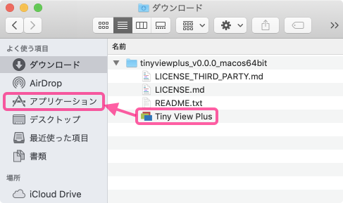
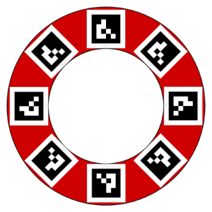
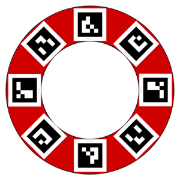

# Tiny View Plus

The English version is [here](./README_en.md).

Tiny View Plusは、FPV映像を手軽に表示するためのアプリです。UVC対応の受信機を、MacBook等のコンピューターに接続して使用します。受信機は4台まで(※)接続できます。

**(※)Windowsの場合、USBハブに複数の受信機を接続すると正しく動作しないことがあります。PC本体のUSBポートに1つにつき、受信機1台のみを接続してください。PC内部でハブが接続されている場合もあり、その場合には正しく動作しません。**

## 動作環境

<table>
<tr>
<td>OS</td><td>macOS (Mojave推奨) Windows (10 64bit推奨)</td>
</tr>
<tr>
<td>受信機</td><td>Eachine ROTG02 Eachine ROTG01</td>
</tr>
</table>

冒頭の写真の例では、USBハブ(C-A)とUSBケーブル(A-microB)を別途用意しています。この場合、ROTG付属のUSBケーブル(OTG用microB-microB)は使用しません。

## インストール

バイナリの作成にあたっては細心の注意を払っていますが、アプリを実行することで起こる不具合については、一切責任を負いません。

ソースコードからビルドする場合は、[こちらのドキュメント](docs/HowToBuild.md)を参照してください。

### macOSの場合

1. [リリースページ](https://github.com/t-asano/tinyviewplus/releases)よりzipファイルをダウンロード
2. zipファイルを「アプリケーション」フォルダの下に配置
    - それ以外の場所に配置すると、ファイルの書き込みを伴う機能が正しく動作しません。
    

### Windowsの場合

1. [リリースページ](https://github.com/t-asano/tinyviewplus/releases)よりzipファイルをダウンロード
2. zipファイルを展開して適当な場所に配置
3. [Microsoft Visual C++ 2015 再頒布可能パッケージ(vc_redist.x64.exe)
](https://www.microsoft.com/ja-jp/download/details.aspx?id=53587)をインストール  
(起動時にVCOMP140.DLLのエラーが出る場合のみ)

## 使い方

### 起動

1. コンピューターに受信機(4台まで)を接続
2. アプリ本体をダブルクリックして起動

### 受信機の検出

受信機がうまく検出されない場合は、以下をお試し下さい。

1. 受信機を全て外す
2. USBハブ使用の場合はそれを接続し直す、または撤去する
3. 受信機を一台ずつ数秒間隔で接続

macOSの場合、USBハブを使用していて映像がコマ落ちするようなら、USBハブ1台あたりの受信機の数を2台以下を目安に減らしてください。

Windowsの場合、USBハブに複数の受信機を接続した場合に、そのうち1台しか動作しないことがあります。この場合、USBハブを経由せずに接続すれば改善するかもしれません。

### キーボードによる操作

#### システム

| キー | 機能 | 初期値 |
|---|---|---|
| N | 音声読み上げ言語の設定(日本語/英語) | システム設定に従う |
| S | システム統計の設定(オン/オフ) | オフ |
| H | ヘルプ(設定/コマンド)の表示 | - |
| I | 設定の初期化 | - |

#### 表示

| キー | 機能 | 初期値 |
|---|---|---|
| F,Esc | フルスクリーン表示の設定(オン/オフ) | オフ |
| T | カメラのトリミングの設定(オン/オフ)(※1) | オフ |
| 1~4 | カメラ1~4の拡大表示の設定(オン/オフ) | オフ |
| command + 1~4 | カメラ1~4の表示の設定(オン/オフ) [macOS] | オン |
| Alt + 1~4 | カメラ1~4の表示の設定(オン/オフ) [Windows] | オン |
| B | 背景画像の設定(※2) | アプリ内蔵の画像 |
| Q | QRコードリーダーの開始/停止(※3) | - |

- (※1)カメラが1台または3台の場合に、映像の一部をトリミングして大きく表示します。
- (※2)背景画像は、縦横比を維持したまま画面に合わせて拡大縮小され、左上が優先表示されます。
- (※3)QRコードから読み取った文字列を、カメラのラベルに設定します。

#### レース

| キー | 機能 | 初期値 |
|---|---|---|
| A | ARラップタイマーのモードの設定(ノーマル/ルーズ/オフ)(※1) | オン |
| D | レースの制限時間(0\~36,000秒)、周回数(1\~10,000)の設定 | 0秒(制限なし)、10周 |
| M | 最小ラップタイムの設定(1~100秒) | 3秒 |
| G | 時差スタートの設定(オン/オフ)(※2) | オフ |
| L | レース中のラップ履歴表示の設定(オン/オフ) | オフ |
| Space | レースの開始/終了 | - |
| 5~8,Z,/ | カメラ1~4,1,3のラップの追加(手動計測) | - |
| command + 5~8,Z,/ | カメラ1~4,1,3の直前ラップの削除 [macOS] | - |
| Alt + 5~8,Z,/ | カメラ1~4,1,3の直前ラップの削除 [Windows] | - |
| R | レースの結果の表示(※3) | - |
| C | レースの結果の消去 | - |
| P | スピードガン機能の設定(オフ/3m/5m/10m/15m/20m)(※4) | オフ |

- (※1)ルーズモードでは、ゲートの外側を通過しても計測対象となります。
- (※2)最初のゲートを通過した後にタイム計測を開始します。
- (※3)レースの結果は、レース終了時に既定フォルダ内へも出力されます。
	- macOSバイナリ版: Tiny View Plus.app/Contents/Resources/data/results
	- それ以外: data/results
- (※4)スピードガン機能を使用する場合の、ゲート間の距離を設定します。

#### ご注意

- アプリを終了すると、システムとレースの設定は保持され、表示の設定は初期化されます
- カメラの音声は出力されません。

### マウスによる操作

一部の機能は、マウスで操作できます。

| 操作 | 機能 |
|---|---|
| カメラ1~4のアイコンをクリック | アイコンの変更(※1) |
| カメラ1~4のラベルをクリック | ラベルの変更(※2) |
|  ボタンをクリック | ヘルプ(設定/コマンド)の表示 |
|  ボタンをクリック | フルスクリーン表示のオン |
|  ボタンをクリック | フルスクリーン表示のオフ |
|  ボタンをクリック | アプリの終了 |

- (※1)カメラのアイコンを変更すると、ラベルが自動的に変更されます。
	- アイコンのファイル名(拡張子を除く)が採用されます。
- (※2)カメラのラベルを変更すると、アイコンが自動的に変更されます。
	- 既定フォルダ内に、ラベル文字列.png または ラベル文字列.jpg という画像ファイルが見つかると、この優先順でアイコン画像として採用されます。
		- macOSバイナリ版: Tiny View Plus.app/Contents/Resources/data/pilots
		- それ以外: data/pilots
	- 画像ファイルが見つからない場合は、デフォルトアイコンが採用されます。
	- 縦横比は強制的に1:1となります。

### ゲームパッドによる操作

一部の機能は、ゲームパッドでも操作もできます。ゲームパッドは、最大4台まで同時に利用できます。

| ボタン | 機能 |
|---|---|
| ボタン1~4 | カメラ1~4のラップの追加(手動計測) |
| ボタン5 + ボタン1~4 | カメラ1~4の直前ラップの削除 |

### QRコードによるラベル設定

QRコードを使用して、カメラのラベルを設定できます。

QRコードを作成するには、Google Charts APIが利用できます。以下は、QRコードを作成するためのURLの例です。

[https://chart.apis.google.com/chart?cht=qr&chs=500x500&chl=TinyViewPlus](https://chart.apis.google.com/chart?cht=qr&chs=500x500&chl=TinyViewPlus)

QRコードをOSDに組み込んでおくと便利です。以下は、Betaflight用のロゴ画像の例です。

※QRコードは(株)デンソーウェーブの登録商標です。

### ARマーカーによるラップ計測

ARマーカーを利用して、ラップタイムを計測できます。

マーカーを4から8個程度、ゲートの周囲に配置してください。またその際に、マーカーの上側がゲートの中央を向くようにしてください。以下の4種類のマーカーに対応していますが、上の図のように1種類のみを配置する形でも構いません。

- [marker_00_main_a.png](docs/img/marker_00_main_a.png)
- [marker_01_main_b.png](docs/img/marker_01_main_b.png)
- [marker_02_main_c.png](docs/img/marker_02_main_c.png)
- [marker_03_main_d.png](docs/img/marker_03_main_d.png)

マーカーのサイズは1辺150mmを目安として、通過スピードに応じて調整してください。ハイスピードレースにおいては、より大きなマーカーが適しています。マーカーの認識がうまくいかない場合は、マーカーを大きくしたり、複数の種類を織り交ぜたり、より明るい場所に設置すると、改善するかもしれません。

ラップタイムの計測は、レース中にのみ行われます。同時に2個以上の正しい向きのマーカーを検出した後、画面からマーカーが消えたタイミングでラップタイムが確定します。ただし、最後に映っていたマーカーの向きが正しくない(ゲートの外側を通った等の)場合は、計測の対象外となります。

環境によっては、マーカーの認識処理が重く、動作に支障があるかもしれません。その場合は、機能を無効化してください。

### 自動計測と手動計測の併用

自動計測と手動計測を併用した場合、タイミングが早い方が採用され、記録に残ります。タイミングが遅い方は却下され、記録に残りません。ただし、両者の間隔が最小ラップタイム設定値以上であれば、別々のラップとみなされ、両者ともに採用され、記録に残ります。

### スピードガン機能(実験的)

2つのゲートを通過するのに要した時間から、平均速度を算出します。メインゲートの直後に、2つ目のゲートを設置してください。ARマーカーは、メインゲートと同一のものを使用します。

ゲート間の距離は、Pキーで設定可能です。距離が大きいほど、高速度における誤差が小さくなります。選択可能なゲート間の距離と、それぞれに適した速度範囲(予想誤差10km/h以内)は、概ね以下のとおりです。

| ゲート間の距離 | 適切な速度範囲 |
| :------------: | :------------: |
|      3 m       |  35 km/h 以下  |
|      5 m       |  45 km/h 以下  |
|      10 m      |  70 km/h 以下  |
|      15 m      |  85 km/h 以下  |
|      20 m      | 100 km/h 以下  |

なお、本機能はレース機能を実験的に拡張して実現しているため、以下のような制限があります。

- スピードガン機能はレース進行中にのみ動作する
- 2つ目のゲートは「最小ラップタイム設定」の時間未満で通過する必要がある
- スピードガン動作中はラップタイム表示/読み上げは動作しない
- レース中のスピードガンの設定変更は不可

## OSCによる制御

OSCプロトコルにより外部からの制御が可能です。詳しくは[こちら](docs/OSCAPI.md)をご覧ください。

## ライセンス

Tiny View Plus is distributed under the MIT License. This gives everyone the freedoms to use Tiny View Plus in any context: commercial or non-commercial, public or private, open or closed source. Please see [LICENSE.md](LICENSE.md) and [LICENSE\_THIRD\_PARTY.md](LICENSE_THIRD_PARTY.md) for details.