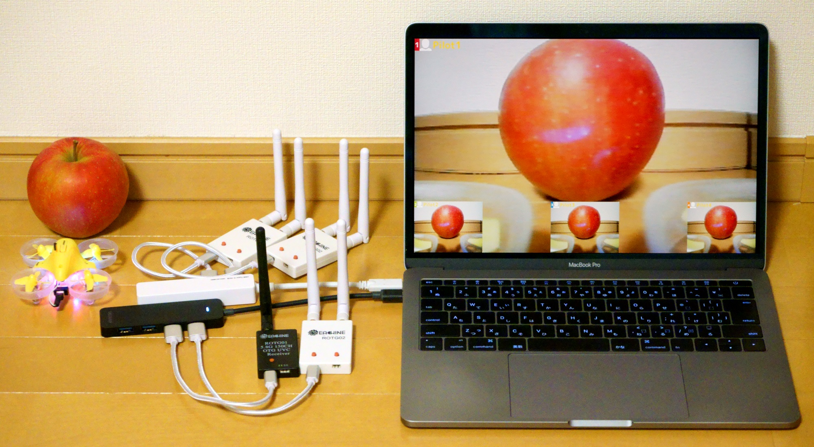

# Tiny View Plus

Tiny View Plusは、FPV映像を3画面同時に表示可能なアプリです。UVC対応の受信機を、MacBook等のコンピューターに接続して使用します。

openFrameworksを使って実装されており、Webアプリとして実装されていた前作([Tiny View](https://github.com/t-asano/tinyview))よりも描画性能が向上しています。



## 動作環境

<table>
<tr>
<td>OS</td><td>macOS (High Sierra以降を推奨)</td>
</tr>
<tr>
<td>受信機</td><td>Eachine ROTG02, ROTG01</td>
</tr>
</table>

- ソースコードからビルドする場合には [openFrameworks](http://openframeworks.cc/ja/) v0.9.8 が必要です
- Windows環境でもビルドできる可能性がありますが、未検証です

## インストール

### ビルド済みバイナリを使用する場合

1. [リリースページ](https://github.com/t-asano/tinyviewplus/releases)よりzipファイルをダウンロード
2. zipファイルを適当な場所に展開

### ソースコードからビルドする場合

1. [openFrameworks](http://openframeworks.cc/ja/) v0.9.8 をインストール
2. [CVPixelBufferに関する修正パッチ](https://github.com/openframeworks/openFrameworks/commit/836fbda74770b7a1df3e136e9d2200b5c2cee8a4)を適用
3. 新規プロジェクトを作成
4. [最新のofxOscアドオン](https://github.com/openframeworks/openFrameworks/tree/master/addons/ofxOsc)を追加
5. [ofxTrueTypeFontUCアドオン](https://github.com/hironishihara/ofxTrueTypeFontUC)を追加
6. ソースコード(src/)とアセット(bin/data/)を取り込み
7. ビルド

## 使い方

### 起動

1. コンピューターに受信機を接続
2. アプリを起動

受信機がうまく検出されない場合は、以下をお試し下さい。

1. アプリを終了
2. 受信機を全て外す
3. USBハブ使用の場合はそれを接続し直す
4. 受信機を一台ずつ数秒間隔で接続
5. アプリを起動

### キー操作

| キー | 機能 | 初期値 |
|---|---|---|
| 1~3 | カメラ1~3の表示/非表示 | 表示 |
| H | ヘルプの表示 | - |
| L | カメラのラベルの変更 | Pilot1~3 |
| R | 設定の初期化（※1） | 各設定の初期値 |
| S | 音声読み上げのオン/オフ(macOSのみ) | オン |
| W | 壁紙の変更 | アプリ内蔵の壁紙 |

- （※1）以下の設定項目が初期化されます
	- カメラの表示/非表示
	- カメラのラベル
	- 音声読み上げのオン/オフ
	- 壁紙
- アプリを終了すると設定は消去されます
- 壁紙は、縦横比を維持しながらウィンドウサイズに合わせて拡大縮小され、左上が優先的に表示されます
- 音声読み上げは、外部アプリとの連携時に動作します
- カメラの音声は出力されません

## OSCによる制御

OSCプロトコルにより外部からの制御が可能です。UDP4000番ポートでOSCパケットを受信します。

### メッセージフォーマット

#### カメラの表示/非表示
/v1/camera/{id}/display {switch}

- パラメーター
    - id ... 1～3の数値
    - switch ... "on" または "off"
- [例]カメラ1を非表示とする
    - /v1/camera/1/display "off"

#### カメラのラベルの変更
/v1/camera/{id}/label {label}

- パラメーター
    - id ... 1～3の数値
    - label ... 任意の文字列(パイロット名など)
- [例]カメラ2のラベルを"WHooper2"とする
    - /v1/camera/2/label "Whooper2"

#### カメラのラップタイムの更新
/v1/camera/{id}/laptime {time}

- パラメーター
    - id ... 1～3の数値
    - label ... ラップタイムを示す数値(秒.ミリ秒)
- [例]カメラ3のラップタイムを128秒64とする
    - /v1/camera/3/laptime 128.64
- [例]カメラ3のラップタイムをクリアする
    - /v1/camera/3/laptime 0

#### 音声読み上げ(macOSのみ)
/v1/speech/{language}/say {text}

- パラメーター
    - language ... "en"(英語)または"jp"(日本語)
    - text ... 読み上げる文
- [例]日本語で"ドローンで遊ぼう"と読み上げる
    - /v1/speeech/jp/say "ドローンで遊ぼう"

### 動作確認

以下のようにして、Node.jsで動作を確認できます。

```js
var osc = require('node-osc');
var client = new osc.Client('127.0.0.1', 4000);
client.send("/v1/camera/1/label", "Whooper1", function () {});
client.send("/v1/camera/1/laptime", 62.09, function () {});
```

## License

Tiny View Plus is distributed under the MIT License. This gives everyone the freedoms to use Tiny View Plus in any context: commercial or non-commercial, public or private, open or closed source. Please see [LICENSE](LICENSE) for details.