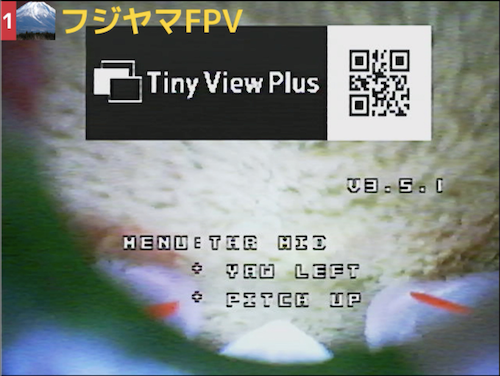
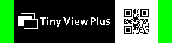
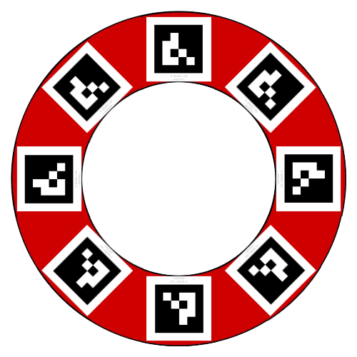

# Tiny View Plus

Tiny View Plus is an application to display FPV video easily with USB receivers. Up to 4 receivers(\*) can be connected.


**(\*)On Windows, it is impossible to connect multiple receivers to the USB hub. Please connect only one receiver to each USB port built in PC.**

## Environment

<table>
<tr>
<td>OS</td><td>macOS (Mojave is recommended)<br/>Windows (10 64bit is recommended)</td>
</tr>
<tr>
<td>FPV Receiver</td><td>Eachine ROTG02<br/>Eachine ROTG01</td>
</tr>
</table>

To build from source code, [openFrameworks](http://openframeworks.cc/ja/) v0.10.1 is required.

## Install

### Case 1: Prebuilt binary

1. Download a zip file from [Release page](https://github.com/t-asano/tinyviewplus/releases).
2. Extract it and place its contents in the proper place.

**On macOS, be sure to put the application under the "Application" folder. If you place it anywhere else, functions that writing to file will not work correctly.**


Attention. We are not responsible for any problems caused by running the application.

### Case 2: Build from source code (for experts)

1. Install [openFrameworks](http://openframeworks.cc/ja/) v0.10.1.
2. Install addons.
```
$ cd addons/
$ git clone -b fix-of_v0.10 https://github.com/t-asano/ofxTrueTypeFontUC.git
$ git clone https://github.com/t-asano/ofxAruco
$ git clone https://github.com/kylemcdonald/ofxCv
$ git clone https://github.com/t-asano/ofxZxing.git
```
3. Create a project with addons.
	- ofxOsc
	- ofxTrueTypeFontUC
	- ofxAruco
	- ofxCv
	- ofxOpenCv
	- ofxPoco
    - ofxZxing
4. Overwrite src/ and bin/data/ of Tiny View Plus.
5. Build.

## Usage

### Launch

1. Connect receivers(Up to 4) to computer.
2. Launch application.

### Detection of receivers

If receivers are not successfully detected, please try following operation.

1. Exit the application.
2. Remove all receivers.
3. If using a USB hub, reconnect it or remove it.
4. Connect receivers one by one at intervals of several seconds.
5. Launch the application.

On macOS, you can check a list of cameras (receivers) with the QuickTime. If you are using a USB hub and the picture drops, please reduce the number of receivers per USB hub.

On Windows, you can check the detection status of the camera (receiver) with the device manager. In addition, if multiple receivers are connected to same USB hub, only one of them may operate.

### Keyboard shortcuts
                        
| key | Function | Default value |
|---|---|---|
| H | Display help | - |
| 1~4 | Camera 1~4 solo view on/off | off |
| T | Solo view triming on/off | off |
| Shift + 1~4 | Camera 1~4 display on/off | on |
| Q | Start/Stop QR code reader (\*1) | - |
| B | Change background image | built-in image |
| F | Fullscreen mode on/off | off |
| A | Switch AR lap timer mode (normal/loose/off) (\*2) | normal |
| O | Lock-on effect on/off (\*3) | off |
| Space | Start/Stop race | - |
| V | Display race results (\*4) | - |
| D | Set race duration time (1\~3600sec) and laps (1\~100) | no limit, 10 |
| M | Set minimum lap time (1~100sec) | 3 |
| N | Change speech language (Japanese/English) | Japanese |
| S | OSC speech on/off | off |
| I | Initialize configuration | - |
| . | Exit application | - |

- (\*1) Sets the characters scanned from the QR code to the camera label.
- The background image is scaled according to the screen, and the upper left is displayed in priority.
- (\*2) In loose mode, lap time will be measured even if the drone passes outside the gate.
- (\*3) If the difference in gate passing time is less than 1 second, tracking side camera display will be enlarged.
- (\*4) Race results will be saved under predefined folder when race finish.
	- macOS binary: Tiny View Plus.app/Contents/ Resources/data/pilots
	- others: data/pilots
- When you exit the application settings will be initialized.
- Camera audio is not supported.

### Mouse operation

Some functions can also be operated with the mouse.

| Click location | Function |
| --- | --- |
| Camera 1~4 icon | Change camera 1~4 icon |
| Camera 1~4 label | Change camera 1~4 label (\*1) |

- (\*1) Camera icon will be automatically changed according to camera label.
	- If {label string}.png or {label string}.jpg was found under predefined folder, it will be adopted as an icon image in this priority order.
		- macOS binary: Tiny View Plus.app/Contents/ Resources/data/pilots
		- others: data/pilots
	- If no image file is found, the default icon will be adopted.
	- The aspect ratio is forced to 1:1.

### QR code reader

You can set the camera label by the QR code.



You can use Google Charts API to create QR codes. An example of URL is as follows.

[https://chart.apis.google.com/chart?cht=qr&chs=500x500&chl=TinyViewPlus](https://chart.apis.google.com/chart?cht=qr&chs=500x500&chl=TinyViewPlus)

It is convenient to embed the QR code in the OSD. An example of an image for the Betaflight is as follows.



### AR lap timer

You can measure the lap time using the AR marker.



Please place four or more of the following marker around the gate. Make sure the top of the marker faces the center of the gate.

- [marker_00_main_a.png](docs/marker_00_main_a.png)

The size of the marker should be 120mm per side. Smaller gate and markers may be suitable for low speed race in narrow space.

Lap time will be measured only during the race. After detecting two or more correctly oriented markers simultaneously, when the marker disappears from the screen, lap time will be confirmed. However, if the direction of the last displayed marker is incorrect, the measurement will be canceled.

Depending on the environment, recognition processing of markers might be heavy. In that case, please disable the function.

## Control by OSC

Tiny View Plus can be controlled by OSC protocol. It receives OSC packet at UDP port 4000.

### Message format

#### Toggle camera solo mode on / off

/v1/camera/{id}/solo {switch}

- Parameters
	- id ... Number from 1 to 4
	- switch ... "on" or "off"
- [Example] camera 1 solo mode on
    - /v1/camera/1/solo "on"

#### Toggle camera visibility on / off

/v1/camera/{id}/display {switch}

- Parameters
	- id ... Number from 1 to 4
	- switch ... "on" or "off"
- [Example] camera 1 off
	- /v1/camera/1/display "off"

#### Change camera label

/v1/camera/{id}/label {label}

- Parameters
	- id ... Number from 1 to 4
	- label ... Any string (such as pilot name)
- [Example] Set the label of camera 2 to "Whooper 2"
	- /v1/camera/2/label "Whooper 2"

Camera icon is also automatically changed in conjunction with the camera label change.

- If {label string}.png or {label string}.jpg was found under "Tiny View Plus.app / Contents / Presents / data / pilots" folder (on macOS binary), otherwise under the "data / pilots" folder,	it is adopted as an icon image in this priority order.
- If no image file is found, the default icon will be adopted.
- The aspect ratio is forced to 1:1.

#### Set camera laptime

/v1/camera/{id}/laptime {time}

- Parameters
	- id ... Number from 1 to 4
	- time ... Number indicating the lap time (seconds)
- [Example] Set the lap time of camera 3 to 128.64 seconds
	- /v1/camera/3/laptime 128.64
- [Example] Clear the lap time of camera 4
	- /v1/camera/4/laptime 0

#### Speech synthesis

/v1/speech/{language}/say {text}

- Parameters
	- language ... "en" (English) or "jp" (Japanese)
	- text ... sentence to speak
- [Example] Say "We can fly!" in English
	- /v1/speeech/en/say "We can fly!"

## License

Tiny View Plus is distributed under the MIT License. This gives everyone the freedoms to use Tiny View Plus in any context: commercial or non-commercial, public or private, open or closed source. Please see [LICENSE.md](LICENSE.md) and [LICENSE\_THIRD\_PARTY.md](LICENSE_THIRD_PARTY.md) for details.